# Codebase Mermaid Diagrams - "This is so PEAK"

**Last Updated:** March 7, 2026  
**Purpose:** Visual architecture diagrams using Mermaid for quick understanding

---

## Table of Contents
1. [System Architecture Overview](#system-architecture-overview)
2. [Save/Load System](#saveload-system)
3. [Player System](#player-system)
4. [Inventory System](#inventory-system)
5. [Interaction System](#interaction-system)
6. [Event Flow Diagrams](#event-flow-diagrams)
7. [Service Container Registry](#service-container-registry)
8. [Complete System Integration](#complete-system-integration)

---

## System Architecture Overview

### Layer Architecture

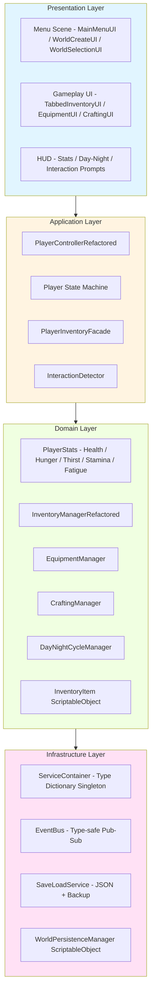
```mermaid
graph TB
    subgraph Presentation["Presentation Layer"]
        Menu[Menu Scene - MainMenuUI / WorldCreateUI / WorldSelectionUI]
        UI[Gameplay UI - TabbedInventoryUI / EquipmentUI / CraftingUI]
        HUD[HUD - Stats / Day-Night / Interaction Prompts]
    end

    subgraph Application["Application Layer"]
        Controller[PlayerControllerRefactored]
        StateMachine[Player State Machine]
        InvFacade[PlayerInventoryFacade]
        InteractionDetector[InteractionDetector]
    end

    subgraph Domain["Domain Layer"]
        PlayerStats[PlayerStats - Health / Hunger / Thirst / Stamina / Fatigue]
        InventoryMgr[InventoryManagerRefactored]
        EquipmentMgr[EquipmentManager]
        CraftingMgr[CraftingManager]
        DayNight[DayNightCycleManager]
        Items[InventoryItem ScriptableObject]
    end

    subgraph Infrastructure["Infrastructure Layer"]
        DI[ServiceContainer - Type Dictionary Singleton]
        EventBus[EventBus - Type-safe Pub-Sub]
        SaveLoad[SaveLoadService - JSON + Backup]
        WorldPersist[WorldPersistenceManager ScriptableObject]
    end

    Presentation --> Application
    Application --> Domain
    Domain --> Infrastructure

    style Presentation fill:#e1f5ff
    style Application fill:#fff4e1
    style Domain fill:#f0ffe1
    style Infrastructure fill:#ffe1f5
```

### Scene Flow

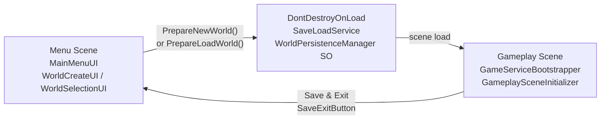
```mermaid
flowchart LR
    MenuScene["Menu Scene\nMainMenuUI\nWorldCreateUI / WorldSelectionUI"]
    GameplayScene["Gameplay Scene\nGameServiceBootstrapper\nGameplaySceneInitializer"]
    Persist["DontDestroyOnLoad\nSaveLoadService\nWorldPersistenceManager SO"]

    MenuScene -- "PrepareNewWorld()\nor PrepareLoadWorld()" --> Persist
    Persist -- "scene load" --> GameplayScene
    GameplayScene -- "Save & Exit\nSaveExitButton" --> MenuScene
```

---

## Save/Load System

### Save System Architecture

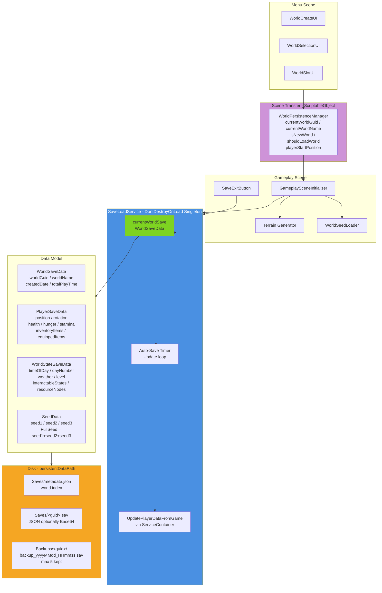
```mermaid
graph TB
    subgraph MenuScene["Menu Scene"]
        WorldCreate[WorldCreateUI]
        WorldSelect[WorldSelectionUI]
        WorldSlot[WorldSlotUI]
    end

    subgraph GameplayScene["Gameplay Scene"]
        GSI[GameplaySceneInitializer]
        TerrainGen[Terrain Generator]
        WorldSeedLoader[WorldSeedLoader]
        SaveExit[SaveExitButton]
    end

    subgraph Transfer["Scene Transfer - ScriptableObject"]
        WPM[WorldPersistenceManager\ncurrentWorldGuid / currentWorldName\nisNewWorld / shouldLoadWorld\nplayerStartPosition]
    end

    subgraph SaveService["SaveLoadService - DontDestroyOnLoad Singleton"]
        CurrentSave[currentWorldSave\nWorldSaveData]
        AutoTimer[Auto-Save Timer\nUpdate loop]
        UpdateFn[UpdatePlayerDataFromGame\nvia ServiceContainer]
    end

    subgraph DataModel["Data Model"]
        WorldData[WorldSaveData\nworldGuid / worldName\ncreatedDate / totalPlayTime]
        PlayerData[PlayerSaveData\nposition / rotation\nhealth / hunger / stamina\ninventoryItems / equippedItems]
        WorldState[WorldStateSaveData\ntimeOfDay / dayNumber\nweather / level\ninteractableStates / resourceNodes]
        Seed[SeedData\nseed1 / seed2 / seed3\nFullSeed = seed1+seed2+seed3]
    end

    subgraph Disk["Disk - persistentDataPath"]
        MetaFile[Saves/metadata.json\nworld index]
        SaveFiles["Saves/&lt;guid&gt;.sav\nJSON optionally Base64"]
        BackupFiles["Backups/&lt;guid&gt;/\nbackup_yyyyMMdd_HHmmss.sav\nmax 5 kept"]
    end

    MenuScene --> WPM
    WPM --> GSI
    GSI --> SaveService
    GSI --> TerrainGen
    GSI --> WorldSeedLoader
    SaveExit --> SaveService

    SaveService --> CurrentSave
    SaveService --> AutoTimer
    AutoTimer --> UpdateFn
    CurrentSave --> DataModel
    DataModel --> Disk

    style SaveService fill:#4a90e2,color:#fff
    style CurrentSave fill:#7ed321
    style Disk fill:#f5a623
    style Transfer fill:#ce93d8
```

### Save Flow Sequence

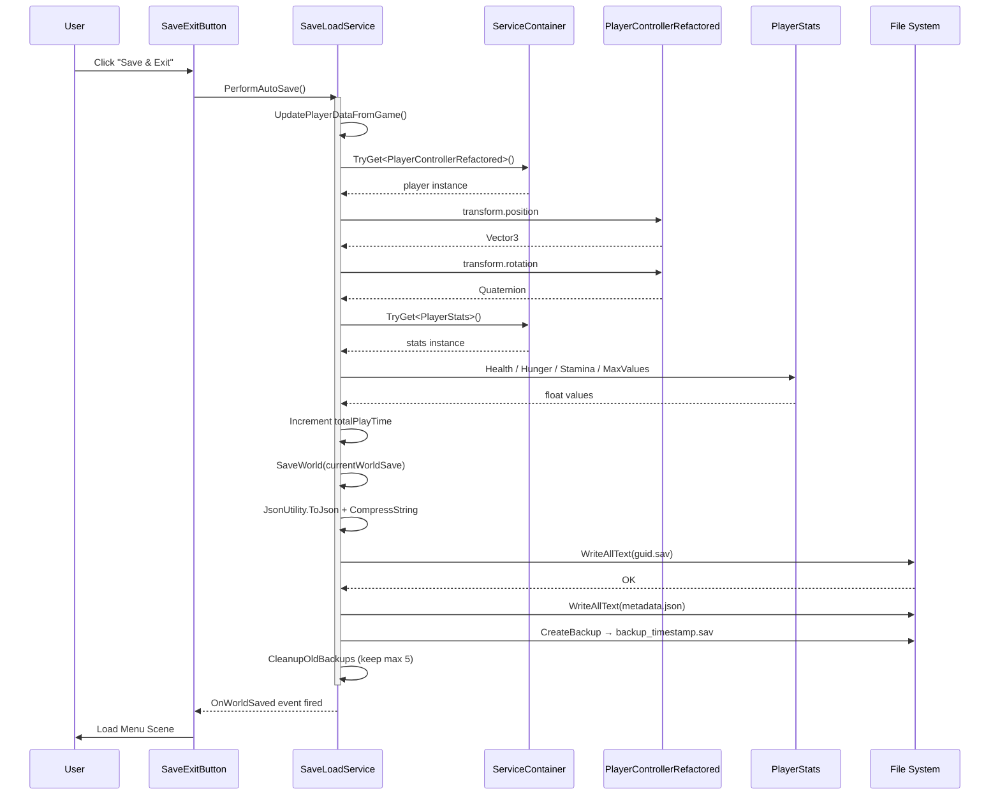
```mermaid
sequenceDiagram
    participant User
    participant Button as SaveExitButton
    participant Service as SaveLoadService
    participant Container as ServiceContainer
    participant Player as PlayerControllerRefactored
    participant Stats as PlayerStats
    participant File as File System

    User->>Button: Click "Save & Exit"
    Button->>Service: PerformAutoSave()
    activate Service

    Service->>Service: UpdatePlayerDataFromGame()
    Service->>Container: TryGet<PlayerControllerRefactored>()
    Container-->>Service: player instance

    Service->>Player: transform.position
    Player-->>Service: Vector3

    Service->>Player: transform.rotation
    Player-->>Service: Quaternion

    Service->>Container: TryGet<PlayerStats>()
    Container-->>Service: stats instance

    Service->>Stats: Health / Hunger / Stamina / MaxValues
    Stats-->>Service: float values

    Service->>Service: Increment totalPlayTime
    Service->>Service: SaveWorld(currentWorldSave)
    Service->>Service: JsonUtility.ToJson + CompressString
    Service->>File: WriteAllText(guid.sav)
    File-->>Service: OK

    Service->>File: WriteAllText(metadata.json)
    Service->>File: CreateBackup → backup_timestamp.sav
    Service->>Service: CleanupOldBackups (keep max 5)

    deactivate Service
    Service-->>Button: OnWorldSaved event fired
    Button->>User: Load Menu Scene
```

### Load / Spawn Decision Flow

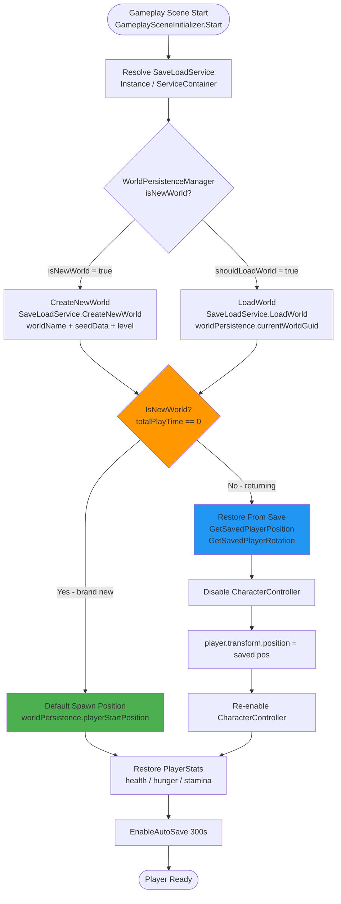
```mermaid
flowchart TD
    Start([Gameplay Scene Start\nGameplaySceneInitializer.Start])
    GetService[Resolve SaveLoadService\nInstance / ServiceContainer]
    CheckWPM{WorldPersistenceManager\nisNewWorld?}

    NewPath[CreateNewWorld\nSaveLoadService.CreateNewWorld\nworldName + seedData + level]
    LoadPath[LoadWorld\nSaveLoadService.LoadWorld\nworldPersistence.currentWorldGuid]

    CheckNew{IsNewWorld?\ntotalPlayTime == 0}

    DefaultSpawn[Default Spawn Position\nworldPersistence.playerStartPosition]
    RestoreSpawn[Restore From Save\nGetSavedPlayerPosition\nGetSavedPlayerRotation]

    DisableCC[Disable CharacterController]
    SetPos[player.transform.position = saved pos]
    EnableCC[Re-enable CharacterController]

    RestoreStats[Restore PlayerStats\nhealth / hunger / stamina]
    EnableAutoSave[EnableAutoSave 300s]

    End([Player Ready])

    Start --> GetService
    GetService --> CheckWPM
    CheckWPM -->|isNewWorld = true| NewPath
    CheckWPM -->|shouldLoadWorld = true| LoadPath

    NewPath --> CheckNew
    LoadPath --> CheckNew

    CheckNew -->|Yes - brand new| DefaultSpawn
    CheckNew -->|No - returning| RestoreSpawn

    DefaultSpawn --> RestoreStats
    RestoreSpawn --> DisableCC
    DisableCC --> SetPos
    SetPos --> EnableCC
    EnableCC --> RestoreStats
    RestoreStats --> EnableAutoSave
    EnableAutoSave --> End

    style CheckNew fill:#ff9800
    style DefaultSpawn fill:#4caf50
    style RestoreSpawn fill:#2196f3
```

### Save Data Class Diagram

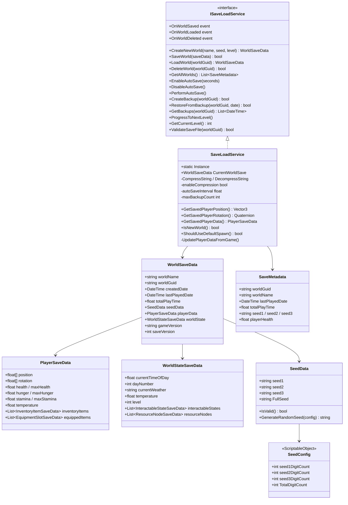
```mermaid
classDiagram
    class ISaveLoadService {
        <<interface>>
        +CreateNewWorld(name, seed, level) WorldSaveData
        +SaveWorld(saveData) bool
        +LoadWorld(worldGuid) WorldSaveData
        +DeleteWorld(worldGuid) bool
        +GetAllWorlds() List~SaveMetadata~
        +EnableAutoSave(seconds)
        +DisableAutoSave()
        +PerformAutoSave()
        +CreateBackup(worldGuid) bool
        +RestoreFromBackup(worldGuid, date) bool
        +GetBackups(worldGuid) List~DateTime~
        +ProgressToNextLevel()
        +GetCurrentLevel() int
        +ValidateSaveFile(worldGuid) bool
        +OnWorldSaved event
        +OnWorldLoaded event
        +OnWorldDeleted event
    }

    class SaveLoadService {
        +static Instance
        +WorldSaveData CurrentWorldSave
        +GetSavedPlayerPosition() Vector3
        +GetSavedPlayerRotation() Quaternion
        +GetSavedPlayerData() PlayerSaveData
        +IsNewWorld() bool
        +ShouldUseDefaultSpawn() bool
        -UpdatePlayerDataFromGame()
        -CompressString / DecompressString
        -enableCompression bool
        -autoSaveInterval float
        -maxBackupCount int
    }

    class WorldSaveData {
        +string worldName
        +string worldGuid
        +DateTime createdDate
        +DateTime lastPlayedDate
        +float totalPlayTime
        +SeedData seedData
        +PlayerSaveData playerData
        +WorldStateSaveData worldState
        +string gameVersion
        +int saveVersion
    }

    class PlayerSaveData {
        +float[] position
        +float[] rotation
        +float health / maxHealth
        +float hunger / maxHunger
        +float stamina / maxStamina
        +float temperature
        +List~InventoryItemSaveData~ inventoryItems
        +List~EquipmentSlotSaveData~ equippedItems
    }

    class WorldStateSaveData {
        +float currentTimeOfDay
        +int dayNumber
        +string currentWeather
        +float temperature
        +int level
        +List~InteractableStateSaveData~ interactableStates
        +List~ResourceNodeSaveData~ resourceNodes
    }

    class SeedData {
        +string seed1
        +string seed2
        +string seed3
        +string FullSeed
        +IsValid() bool
        +GenerateRandomSeed(config) string
    }

    class SeedConfig {
        <<ScriptableObject>>
        +int seed1DigitCount
        +int seed2DigitCount
        +int seed3DigitCount
        +int TotalDigitCount
    }

    class SaveMetadata {
        +string worldGuid
        +string worldName
        +DateTime lastPlayedDate
        +float totalPlayTime
        +string seed1 / seed2 / seed3
        +float playerHealth
    }

    ISaveLoadService <|.. SaveLoadService
    SaveLoadService --> WorldSaveData
    WorldSaveData --> PlayerSaveData
    WorldSaveData --> WorldStateSaveData
    WorldSaveData --> SeedData
    SeedData --> SeedConfig
    SaveLoadService --> SaveMetadata
```

---

## Player System

### Player Controller Architecture

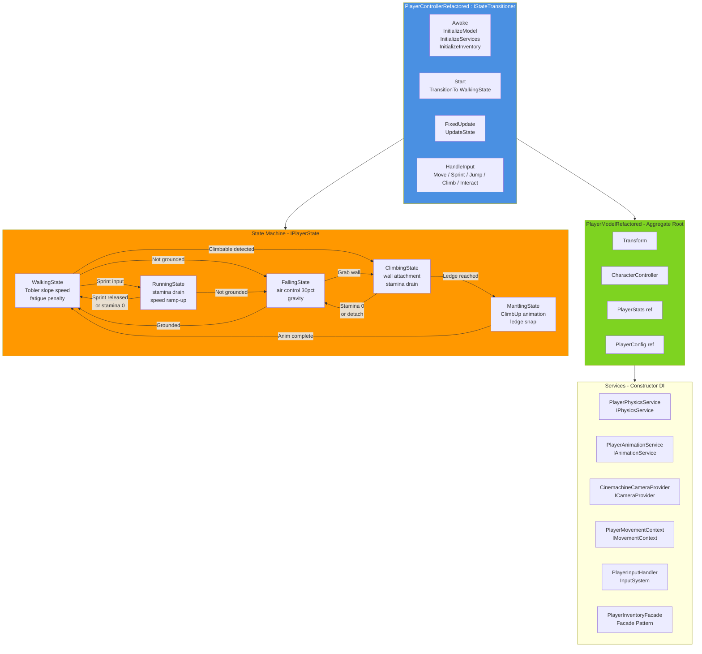
```mermaid
graph TB
    subgraph Controller["PlayerControllerRefactored : IStateTransitioner"]
        Awake[Awake\nInitializeModel\nInitializeServices\nInitializeInventory]
        Start[Start\nTransitionTo WalkingState]
        FixedUpdate[FixedUpdate\nUpdateState]
        InputHandling[HandleInput\nMove / Sprint / Jump / Climb / Interact]
    end

    subgraph Model["PlayerModelRefactored - Aggregate Root"]
        Transform[Transform]
        CharController[CharacterController]
        Stats[PlayerStats ref]
        Config[PlayerConfig ref]
    end

    subgraph Services["Services - Constructor DI"]
        Physics[PlayerPhysicsService\nIPhysicsService]
        Animation[PlayerAnimationService\nIAnimationService]
        Camera[CinemachineCameraProvider\nICameraProvider]
        MovCtx[PlayerMovementContext\nIMovementContext]
        Input[PlayerInputHandler\nInputSystem]
        InvFacade[PlayerInventoryFacade\nFacade Pattern]
    end

    subgraph StateMachine["State Machine - IPlayerState"]
        Walking[WalkingState\nTobler slope speed\nfatigue penalty]
        Running[RunningState\nstamina drain\nspeed ramp-up]
        Climbing[ClimbingState\nwall attachment\nstamina drain]
        Mantling[MantlingState\nClimbUp animation\nledge snap]
        Falling[FallingState\nair control 30pct\ngravity]
    end

    Controller --> Model
    Controller --> StateMachine
    Model --> Services

    Walking -->|Sprint input| Running
    Walking -->|Climbable detected| Climbing
    Walking -->|Not grounded| Falling
    Running -->|Sprint released\nor stamina 0| Walking
    Running -->|Not grounded| Falling
    Climbing -->|Stamina 0\nor detach| Falling
    Climbing -->|Ledge reached| Mantling
    Mantling -->|Anim complete| Walking
    Falling -->|Grounded| Walking
    Falling -->|Grab wall| Climbing

    style Controller fill:#4a90e2,color:#fff
    style Model fill:#7ed321
    style StateMachine fill:#ff9800
```

### State Transition Diagram

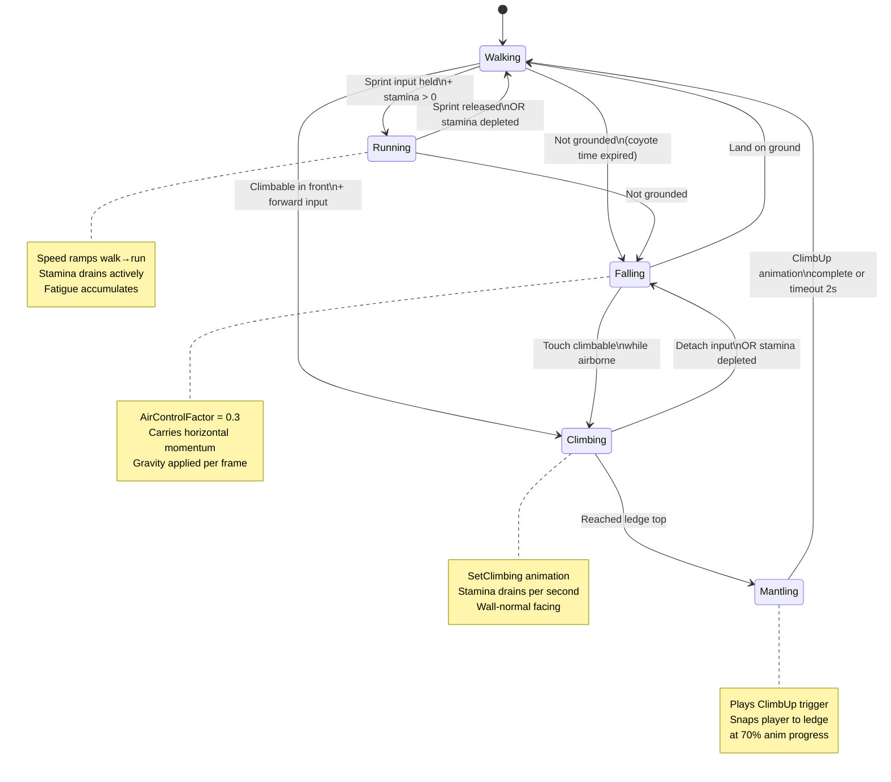
```mermaid
stateDiagram-v2
    [*] --> Walking

    Walking --> Running: Sprint input held\n+ stamina > 0
    Walking --> Climbing: Climbable in front\n+ forward input
    Walking --> Falling: Not grounded\n(coyote time expired)

    Running --> Walking: Sprint released\nOR stamina depleted
    Running --> Falling: Not grounded

    Climbing --> Falling: Detach input\nOR stamina depleted
    Climbing --> Mantling: Reached ledge top

    Mantling --> Walking: ClimbUp animation\ncomplete or timeout 2s

    Falling --> Walking: Land on ground
    Falling --> Climbing: Touch climbable\nwhile airborne

    note right of Running
        Speed ramps walk→run
        Stamina drains actively
        Fatigue accumulates
    end note

    note right of Climbing
        SetClimbing animation
        Stamina drains per second
        Wall-normal facing
    end note

    note right of Mantling
        Plays ClimbUp trigger
        Snaps player to ledge
        at 70% anim progress
    end note

    note right of Falling
        AirControlFactor = 0.3
        Carries horizontal momentum
        Gravity applied per frame
    end note
```

### PlayerStats Component

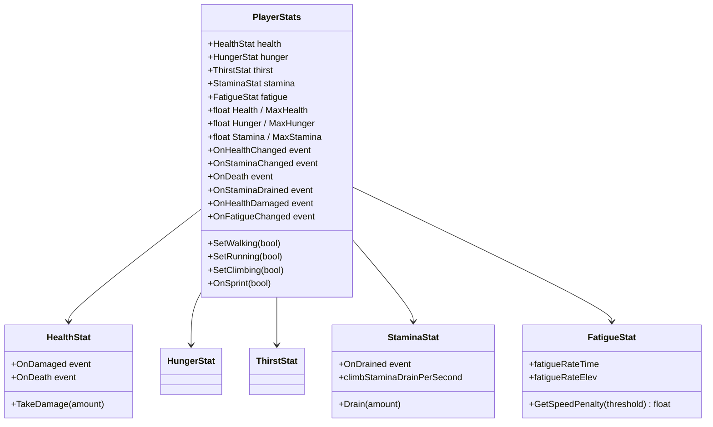
```mermaid
classDiagram
    class PlayerStats {
        +HealthStat health
        +HungerStat hunger
        +ThirstStat thirst
        +StaminaStat stamina
        +FatigueStat fatigue
        +float Health / MaxHealth
        +float Hunger / MaxHunger
        +float Stamina / MaxStamina
        +OnHealthChanged event
        +OnStaminaChanged event
        +OnDeath event
        +OnStaminaDrained event
        +OnHealthDamaged event
        +OnFatigueChanged event
        +SetWalking(bool)
        +SetRunning(bool)
        +SetClimbing(bool)
        +OnSprint(bool)
    }

    class FatigueStat {
        +GetSpeedPenalty(threshold) float
        +fatigueRateTime
        +fatigueRateElev
    }

    class StaminaStat {
        +Drain(amount)
        +OnDrained event
        +climbStaminaDrainPerSecond
    }

    class HealthStat {
        +TakeDamage(amount)
        +OnDamaged event
        +OnDeath event
    }

    PlayerStats --> HealthStat
    PlayerStats --> HungerStat
    PlayerStats --> ThirstStat
    PlayerStats --> StaminaStat
    PlayerStats --> FatigueStat
```

---

## Inventory System

### Inventory System Architecture

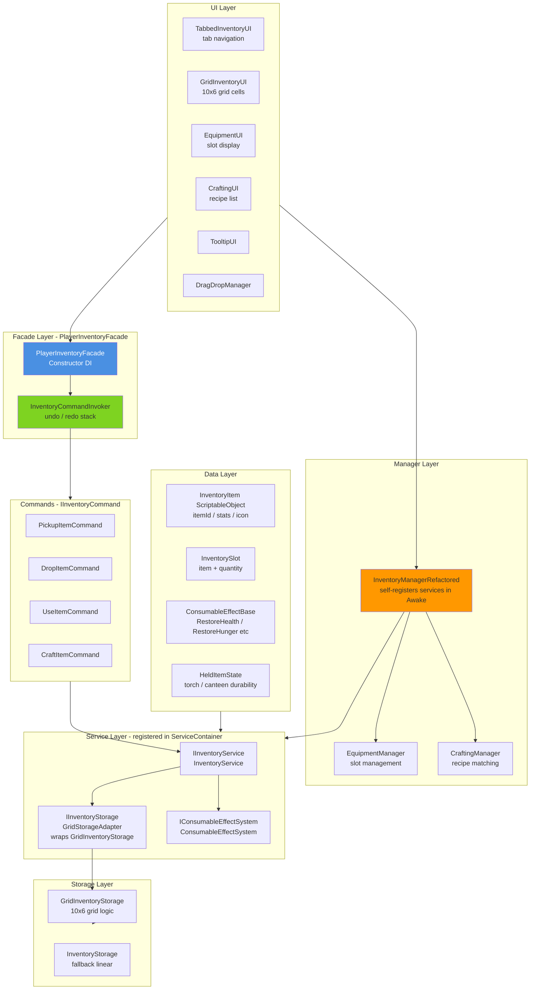
```mermaid
graph TB
    subgraph UILayer["UI Layer"]
        TabbedUI[TabbedInventoryUI\ntab navigation]
        GridUI[GridInventoryUI\n10x6 grid cells]
        EquipUI[EquipmentUI\nslot display]
        CraftUI[CraftingUI\nrecipe list]
        Tooltip[TooltipUI]
        DragDrop[DragDropManager]
    end

    subgraph FacadeLayer["Facade Layer - PlayerInventoryFacade"]
        Facade[PlayerInventoryFacade\nConstructor DI]
        Invoker[InventoryCommandInvoker\nundo / redo stack]
    end

    subgraph Commands["Commands - IInventoryCommand"]
        Pickup[PickupItemCommand]
        Drop[DropItemCommand]
        Use[UseItemCommand]
        Craft[CraftItemCommand]
    end

    subgraph ManagerLayer["Manager Layer"]
        InvMgr[InventoryManagerRefactored\nself-registers services in Awake]
        EquipMgr[EquipmentManager\nslot management]
        CraftMgr[CraftingManager\nrecipe matching]
    end

    subgraph ServiceLayer["Service Layer - registered in ServiceContainer"]
        InvSvc[IInventoryService\nInventoryService]
        InvStore[IInventoryStorage\nGridStorageAdapter\nwraps GridInventoryStorage]
        EffectSys[IConsumableEffectSystem\nConsumableEffectSystem]
    end

    subgraph StorageLayer["Storage Layer"]
        GridStore[GridInventoryStorage\n10x6 grid logic]
        SlotStore[InventoryStorage\nfallback linear]
    end

    subgraph DataLayer["Data Layer"]
        Item[InventoryItem ScriptableObject\nitemId / stats / icon]
        Slot[InventorySlot\nitem + quantity]
        Effects[ConsumableEffectBase\nRestoreHealth / RestoreHunger etc]
        HeldItems[HeldItemState\ntorch / canteen durability]
    end

    UILayer --> Facade
    UILayer --> InvMgr
    Facade --> Invoker
    Invoker --> Commands
    Commands --> InvSvc
    InvMgr --> ServiceLayer
    InvMgr --> EquipMgr
    InvMgr --> CraftMgr
    InvSvc --> InvStore
    InvStore --> GridStore
    InvSvc --> EffectSys
    GridStore --> StorageLayer
    DataLayer --> ServiceLayer

    style Facade fill:#4a90e2,color:#fff
    style Invoker fill:#7ed321
    style InvMgr fill:#ff9800
```

### Pickup Item Command Flow

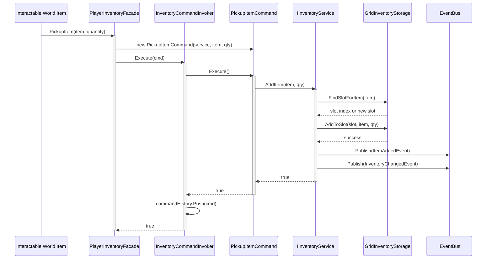
```mermaid
sequenceDiagram
    participant World as Interactable World Item
    participant Facade as PlayerInventoryFacade
    participant Invoker as InventoryCommandInvoker
    participant Cmd as PickupItemCommand
    participant InvSvc as IInventoryService
    participant Store as GridInventoryStorage
    participant Bus as IEventBus

    World->>Facade: PickupItem(item, quantity)
    activate Facade

    Facade->>Cmd: new PickupItemCommand(service, item, qty)
    Facade->>Invoker: Execute(cmd)
    activate Invoker

    Invoker->>Cmd: Execute()
    activate Cmd

    Cmd->>InvSvc: AddItem(item, qty)
    activate InvSvc

    InvSvc->>Store: FindSlotForItem(item)
    Store-->>InvSvc: slot index or new slot

    InvSvc->>Store: AddToSlot(slot, item, qty)
    Store-->>InvSvc: success

    InvSvc->>Bus: Publish(ItemAddedEvent)
    InvSvc->>Bus: Publish(InventoryChangedEvent)
    InvSvc-->>Cmd: true

    deactivate InvSvc

    Cmd-->>Invoker: true
    deactivate Cmd

    Invoker->>Invoker: commandHistory.Push(cmd)
    Invoker-->>Facade: true
    deactivate Invoker

    deactivate Facade
```

---

## Interaction System

### Interaction Detection Flow

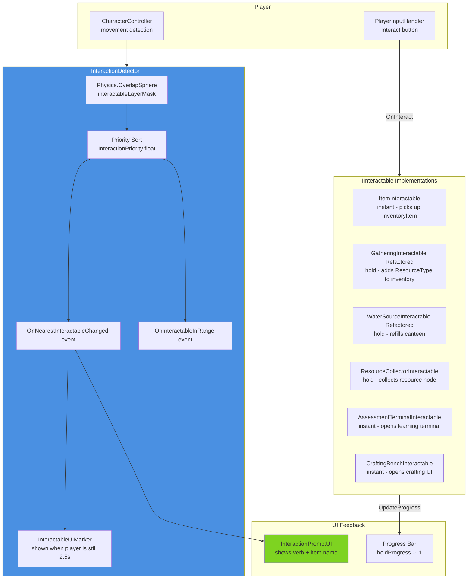
```mermaid
graph TB
    subgraph PlayerSide["Player"]
        CC[CharacterController\nmovement detection]
        InputH[PlayerInputHandler\nInteract button]
    end

    subgraph Detector["InteractionDetector\nRadius: 2.5 m  |  Poll: 0.1 s"]
        Overlap[Physics.OverlapSphere\ninteractableLayerMask]
        Priority[Priority Sort\nInteractionPriority float]
        NearestEvt[OnNearestInteractableChanged event]
        RangeEvt[OnInteractableInRange event]
        UIMarkers[InteractableUIMarker\nshown when player is still 2.5s]
    end

    subgraph Interactables["IInteractable Implementations"]
        ItemInteract[ItemInteractable\ninstant - picks up InventoryItem]
        GatherRef[GatheringInteractable Refactored\nhold - adds ResourceType to inventory]
        WaterRef[WaterSourceInteractable Refactored\nhold - refills canteen]
        ResCollect[ResourceCollectorInteractable\nhold - collects resource node]
        Assessment[AssessmentTerminalInteractable\ninstant - opens learning terminal]
        CraftBench[CraftingBenchInteractable\ninstant - opens crafting UI]
    end

    subgraph Prompt["UI Feedback"]
        PromptUI[InteractionPromptUI\nshows verb + item name]
        ProgressBar[Progress Bar\nholdProgress 0..1]
    end

    CC --> Detector
    Overlap --> Priority
    Priority --> NearestEvt
    Priority --> RangeEvt
    NearestEvt --> PromptUI
    NearestEvt --> UIMarkers
    InputH -->|OnInteract| Interactables
    Interactables -->|UpdateProgress| ProgressBar

    style Detector fill:#4a90e2,color:#fff
    style PromptUI fill:#7ed321
```

### Hold-to-Interact Class Hierarchy

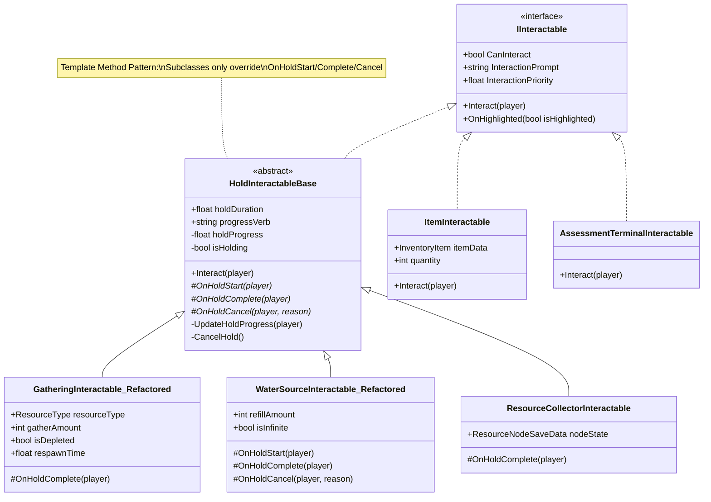
```mermaid
classDiagram
    class IInteractable {
        <<interface>>
        +bool CanInteract
        +string InteractionPrompt
        +float InteractionPriority
        +Interact(player)
        +OnHighlighted(bool isHighlighted)
    }

    class HoldInteractableBase {
        <<abstract>>
        +float holdDuration
        +string progressVerb
        -float holdProgress
        -bool isHolding
        +Interact(player)
        #OnHoldStart(player)*
        #OnHoldComplete(player)*
        #OnHoldCancel(player, reason)*
        -UpdateHoldProgress(player)
        -CancelHold()
    }

    class GatheringInteractable_Refactored {
        +ResourceType resourceType
        +int gatherAmount
        +bool isDepleted
        +float respawnTime
        #OnHoldComplete(player)
    }

    class WaterSourceInteractable_Refactored {
        +int refillAmount
        +bool isInfinite
        #OnHoldStart(player)
        #OnHoldComplete(player)
        #OnHoldCancel(player, reason)
    }

    class ResourceCollectorInteractable {
        +ResourceNodeSaveData nodeState
        #OnHoldComplete(player)
    }

    class ItemInteractable {
        +InventoryItem itemData
        +int quantity
        +Interact(player)
    }

    class AssessmentTerminalInteractable {
        +Interact(player)
    }

    IInteractable <|.. HoldInteractableBase
    IInteractable <|.. ItemInteractable
    IInteractable <|.. AssessmentTerminalInteractable
    HoldInteractableBase <|-- GatheringInteractable_Refactored
    HoldInteractableBase <|-- WaterSourceInteractable_Refactored
    HoldInteractableBase <|-- ResourceCollectorInteractable

    note for HoldInteractableBase "Template Method Pattern:\nSubclasses only override\nOnHoldStart/Complete/Cancel"
```

---

## Event Flow Diagrams

### All Game Events

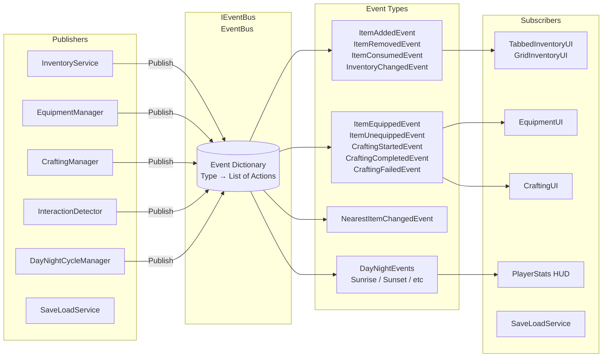
```mermaid
graph LR
    subgraph Publishers["Publishers"]
        InvSvc[InventoryService]
        EquipMgr[EquipmentManager]
        CraftMgr[CraftingManager]
        Detector[InteractionDetector]
        DayNight[DayNightCycleManager]
        SaveSvc[SaveLoadService]
    end

    subgraph EventBus["IEventBus\nEventBus"]
        Bus[(Event Dictionary\nType → List of Actions)]
    end

    subgraph Events["Event Types"]
        IE[ItemAddedEvent\nItemRemovedEvent\nItemConsumedEvent\nInventoryChangedEvent]
        GE[ItemEquippedEvent\nItemUnequippedEvent\nCraftingStartedEvent\nCraftingCompletedEvent\nCraftingFailedEvent]
        DE[NearestItemChangedEvent]
        DNE[DayNightEvents\nSunrise / Sunset / etc]
    end

    subgraph Subscribers["Subscribers"]
        InvUI[TabbedInventoryUI\nGridInventoryUI]
        EquipUI[EquipmentUI]
        CraftUI[CraftingUI]
        StatsUI[PlayerStats HUD]
        SaveSystem[SaveLoadService]
    end

    InvSvc -->|Publish| Bus
    EquipMgr -->|Publish| Bus
    CraftMgr -->|Publish| Bus
    Detector -->|Publish| Bus
    DayNight -->|Publish| Bus

    Bus --> IE
    Bus --> GE
    Bus --> DE
    Bus --> DNE

    IE --> InvUI
    GE --> EquipUI
    GE --> CraftUI
    DNE --> StatsUI
```

### Equipment Change Event Flow

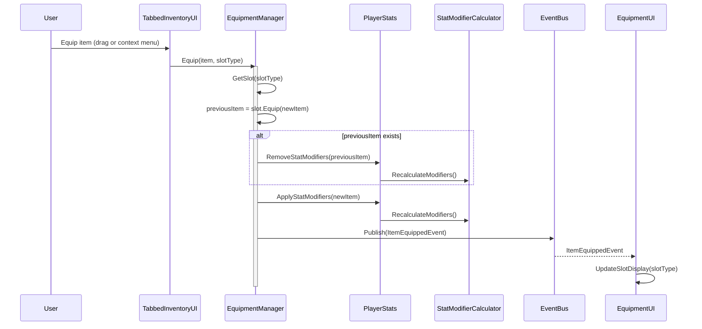
```mermaid
sequenceDiagram
    participant User
    participant InvUI as TabbedInventoryUI
    participant EquipMgr as EquipmentManager
    participant Stats as PlayerStats
    participant ModCalc as StatModifierCalculator
    participant EventBus
    participant EquipUI as EquipmentUI

    User->>InvUI: Equip item (drag or context menu)
    InvUI->>EquipMgr: Equip(item, slotType)
    activate EquipMgr

    EquipMgr->>EquipMgr: GetSlot(slotType)
    EquipMgr->>EquipMgr: previousItem = slot.Equip(newItem)

    alt previousItem exists
        EquipMgr->>Stats: RemoveStatModifiers(previousItem)
        Stats->>ModCalc: RecalculateModifiers()
    end

    EquipMgr->>Stats: ApplyStatModifiers(newItem)
    Stats->>ModCalc: RecalculateModifiers()

    EquipMgr->>EventBus: Publish(ItemEquippedEvent)
    EventBus-->>EquipUI: ItemEquippedEvent
    EquipUI->>EquipUI: UpdateSlotDisplay(slotType)

    deactivate EquipMgr
```

### Auto-Save Trigger Flow

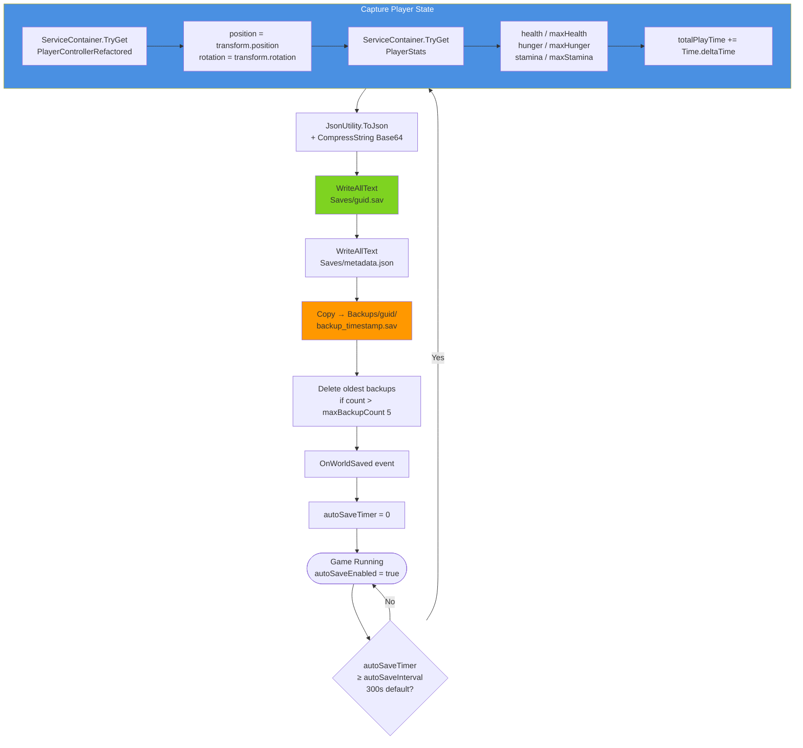
```mermaid
flowchart TD
    Start([Game Running\nautoSaveEnabled = true])
    Timer{autoSaveTimer\n≥ autoSaveInterval\n300s default?}

    subgraph CaptureState["Capture Player State"]
        GetPlayer[ServiceContainer.TryGet\nPlayerControllerRefactored]
        CapturePos[position = transform.position\nrotation = transform.rotation]
        GetStats[ServiceContainer.TryGet\nPlayerStats]
        CaptureStats[health / maxHealth\nhunger / maxHunger\nstamina / maxStamina]
        UpdateTime[totalPlayTime += Time.deltaTime]
    end

    Serialize[JsonUtility.ToJson\n+ CompressString Base64]
    WriteFile[WriteAllText\nSaves/guid.sav]
    WriteMeta[WriteAllText\nSaves/metadata.json]
    CreateBackup[Copy → Backups/guid/\nbackup_timestamp.sav]
    Cleanup[Delete oldest backups\nif count > maxBackupCount 5]
    FireEvent[OnWorldSaved event]
    Reset[autoSaveTimer = 0]

    Start --> Timer
    Timer -->|No| Start
    Timer -->|Yes| CaptureState

    GetPlayer --> CapturePos
    CapturePos --> GetStats
    GetStats --> CaptureStats
    CaptureStats --> UpdateTime

    CaptureState --> Serialize
    Serialize --> WriteFile
    WriteFile --> WriteMeta
    WriteMeta --> CreateBackup
    CreateBackup --> Cleanup
    Cleanup --> FireEvent
    FireEvent --> Reset
    Reset --> Start

    style CaptureState fill:#4a90e2,color:#fff
    style WriteFile fill:#7ed321
    style CreateBackup fill:#ff9800
```

---

## Service Container Registry

### What Gets Registered and By Whom

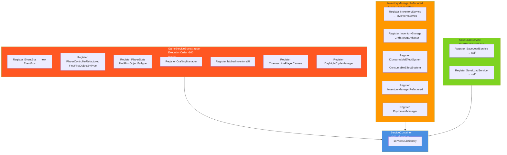
```mermaid
graph TB
    subgraph Bootstrap["GameServiceBootstrapper\nExecutionOrder -100\nAwake"]
        direction TB
        B1[Register IEventBus → new EventBus]
        B2[Register PlayerControllerRefactored\nFindFirstObjectByType]
        B3[Register PlayerStats\nFindFirstObjectByType]
        B4[Register CraftingManager]
        B5[Register TabbedInventoryUI]
        B6[Register CinemachinePlayerCamera]
        B7[Register DayNightCycleManager]
    end

    subgraph InvMgrAwake["InventoryManagerRefactored\nAwake - self-registers"]
        I1[Register IInventoryService\n→ InventoryService]
        I2[Register IInventoryStorage\n→ GridStorageAdapter]
        I3[Register IConsumableEffectSystem\n→ ConsumableEffectSystem]
        I4[Register InventoryManagerRefactored]
        I5[Register EquipmentManager]
    end

    subgraph SaveLoad["SaveLoadService\nDontDestroyOnLoad\nRegisters itself"]
        S1[Register ISaveLoadService → self]
        S2[Register SaveLoadService → self]
    end

    subgraph Container["ServiceContainer\nstatic singleton\nDictionary Type→object"]
        Reg[services Dictionary]
    end

    Bootstrap --> Container
    InvMgrAwake --> Container
    SaveLoad --> Container

    style Container fill:#4a90e2,color:#fff
    style Bootstrap fill:#ff5722,color:#fff
    style InvMgrAwake fill:#ff9800
    style SaveLoad fill:#7ed321
```

### Service Resolution

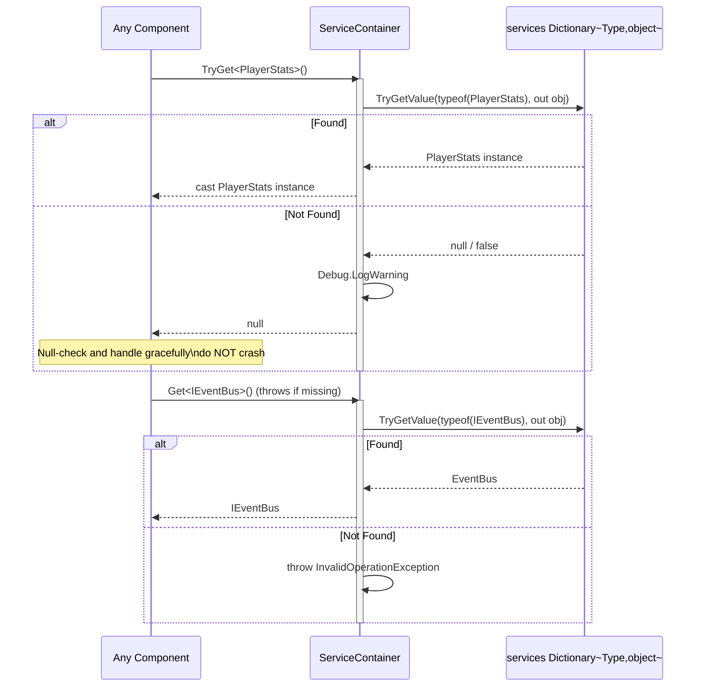
```mermaid
sequenceDiagram
    participant Client as Any Component
    participant Container as ServiceContainer
    participant Dict as services Dictionary~Type,object~

    Client->>Container: TryGet<PlayerStats>()
    activate Container
    Container->>Dict: TryGetValue(typeof(PlayerStats), out obj)

    alt Found
        Dict-->>Container: PlayerStats instance
        Container-->>Client: cast PlayerStats instance
    else Not Found
        Dict-->>Container: null / false
        Container->>Container: Debug.LogWarning
        Container-->>Client: null
        Note over Client: Null-check and handle gracefully\ndo NOT crash
    end
    deactivate Container

    Client->>Container: Get<IEventBus>() (throws if missing)
    activate Container
    Container->>Dict: TryGetValue(typeof(IEventBus), out obj)
    alt Found
        Dict-->>Container: EventBus
        Container-->>Client: IEventBus
    else Not Found
        Container->>Container: throw InvalidOperationException
    end
    deactivate Container
```

---

## Complete System Integration

### Full Game Initialization Sequence

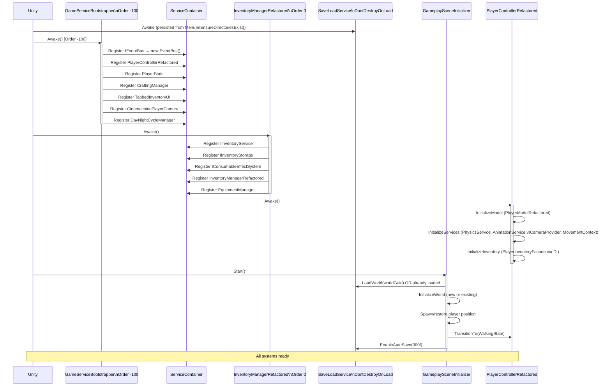
```mermaid
sequenceDiagram
    participant Unity
    participant Bootstrap as GameServiceBootstrapper\nOrder -100
    participant Container as ServiceContainer
    participant InvMgr as InventoryManagerRefactored\nOrder 0
    participant SaveSvc as SaveLoadService\nDontDestroyOnLoad
    participant GSI as GameplaySceneInitializer
    participant Player as PlayerControllerRefactored

    Unity->>SaveSvc: Awake (persisted from Menu)\nEnsureDirectoriesExist()

    Unity->>Bootstrap: Awake() [Order -100]
    activate Bootstrap
    Bootstrap->>Container: Register IEventBus → new EventBus()
    Bootstrap->>Container: Register PlayerControllerRefactored
    Bootstrap->>Container: Register PlayerStats
    Bootstrap->>Container: Register CraftingManager
    Bootstrap->>Container: Register TabbedInventoryUI
    Bootstrap->>Container: Register CinemachinePlayerCamera
    Bootstrap->>Container: Register DayNightCycleManager
    deactivate Bootstrap

    Unity->>InvMgr: Awake()
    activate InvMgr
    InvMgr->>Container: Register IInventoryService
    InvMgr->>Container: Register IInventoryStorage
    InvMgr->>Container: Register IConsumableEffectSystem
    InvMgr->>Container: Register InventoryManagerRefactored
    InvMgr->>Container: Register EquipmentManager
    deactivate InvMgr

    Unity->>Player: Awake()
    activate Player
    Player->>Player: InitializeModel (PlayerModelRefactored)
    Player->>Player: InitializeServices (PhysicsService, AnimationService,\nCameraProvider, MovementContext)
    Player->>Player: InitializeInventory (PlayerInventoryFacade via DI)
    deactivate Player

    Unity->>GSI: Start()
    activate GSI
    GSI->>SaveSvc: LoadWorld(worldGuid) OR already loaded
    GSI->>GSI: InitializeWorld (new or existing)
    GSI->>GSI: Spawn/restore player position
    GSI->>Player: TransitionTo(WalkingState)
    GSI->>SaveSvc: EnableAutoSave(300f)
    deactivate GSI

    Note over Unity,Player: All systems ready
```

### Gameplay Loop

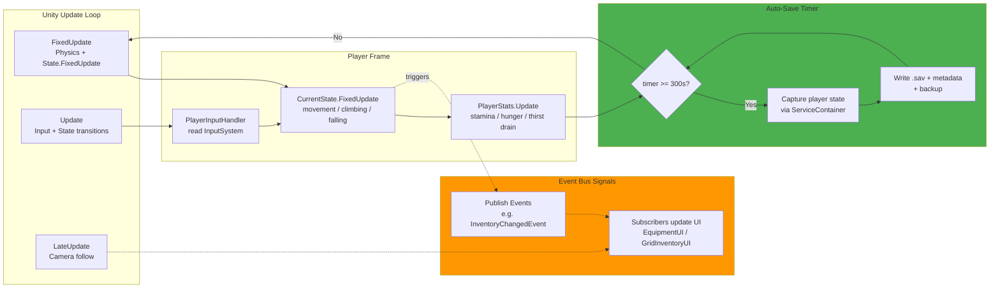
```mermaid
flowchart LR
    subgraph GameLoop["Unity Update Loop"]
        FU[FixedUpdate\nPhysics + State.FixedUpdate]
        U[Update\nInput + State transitions]
        LU[LateUpdate\nCamera follow]
    end

    subgraph PlayerFlow["Player Frame"]
        Input[PlayerInputHandler\nread InputSystem]
        StateUpdate[CurrentState.FixedUpdate\nmovement / climbing / falling]
        StatsUpdate[PlayerStats.Update\nstamina / hunger / thirst drain]
    end

    subgraph AutoSave["Auto-Save Timer"]
        ASTimer{timer >= 300s?}
        ASCapture[Capture player state\nvia ServiceContainer]
        ASSave[Write .sav + metadata\n+ backup]
    end

    subgraph EventSignals["Event Bus Signals"]
        Pub[Publish Events\ne.g. InventoryChangedEvent]
        Sub[Subscribers update UI\nEquipmentUI / GridInventoryUI]
    end

    FU --> StateUpdate
    U --> Input
    Input --> StateUpdate
    StateUpdate --> StatsUpdate
    StatsUpdate --> ASTimer
    ASTimer -->|Yes| ASCapture
    ASCapture --> ASSave
    ASSave --> ASTimer
    ASTimer -->|No| FU
    StateUpdate -.->|triggers| Pub
    Pub -.-> Sub
    LU -.-> Sub

    style AutoSave fill:#4caf50
    style EventSignals fill:#ff9800
```

---

## Summary

Diagrams in this file cover:
- ✅ Full layer architecture and scene flow
- ✅ Save/Load system — architecture, save sequence, load/spawn decision, class diagram
- ✅ Player system — controller, services, state machine (5 states), PlayerStats
- ✅ Inventory system — UI → Facade → Commands → Services → Grid storage
- ✅ Interaction system — detector, hold-template hierarchy, all interactable types
- ✅ Event bus — all event types, equipment flow, auto-save flow
- ✅ Service container — registration sources, resolution logic
- ✅ Full initialization sequence and gameplay loop

**All diagrams use Mermaid syntax** and render in GitHub, GitLab, VS Code (Mermaid extension), and most modern markdown viewers.

---

**Last Updated:** March 7, 2026
