# Codebase Mermaid Diagrams - "This is so PEAK"

**Last Updated:** February 16, 2026  
**Purpose:** Visual architecture diagrams using Mermaid for quick understanding

---

## Table of Contents
1. [System Architecture Overview](#system-architecture-overview)
2. [Save/Load System](#saveload-system)
3. [Player System](#player-system)
4. [Inventory System](#inventory-system)
5. [Interaction System](#interaction-system)
6. [Event Flow Diagrams](#event-flow-diagrams)
7. [Service Container Registry](#service-container-registry)

---

## System Architecture Overview

### Layer Architecture

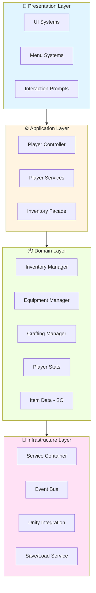

---

## Save/Load System

### Save System Architecture

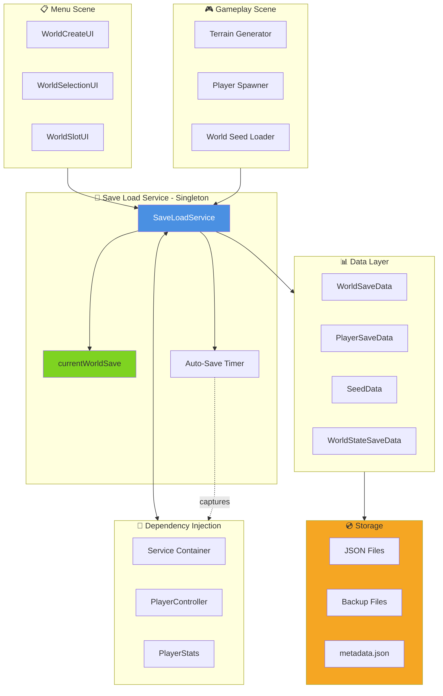

### Save Flow Sequence

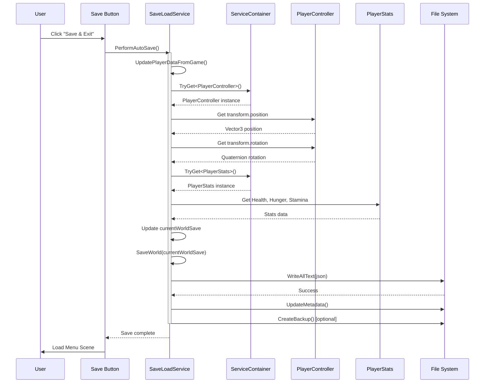

### Load/Spawn Decision Flow

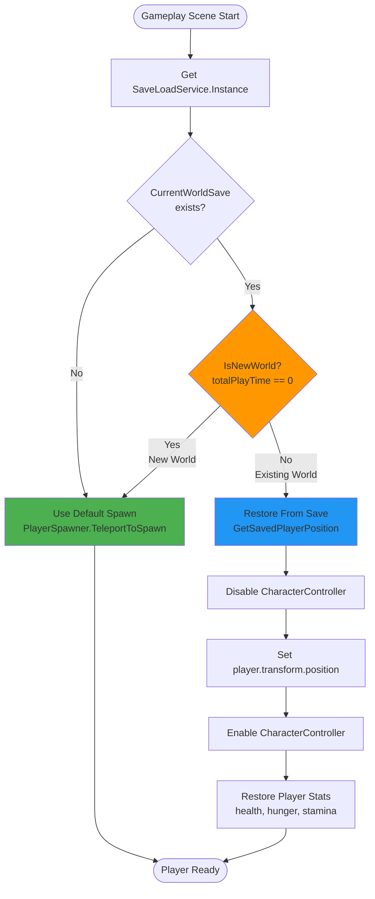

### Public API Reference

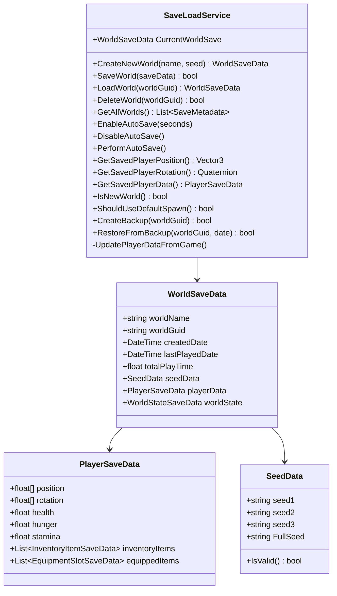

---

## Player System

### Player Controller Architecture

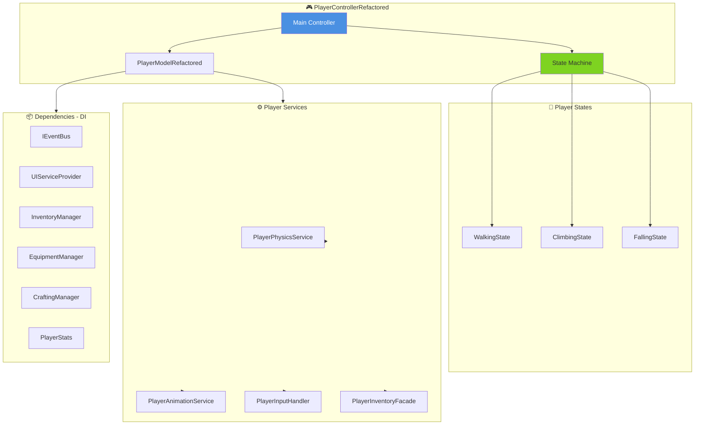

### State Transition Diagram

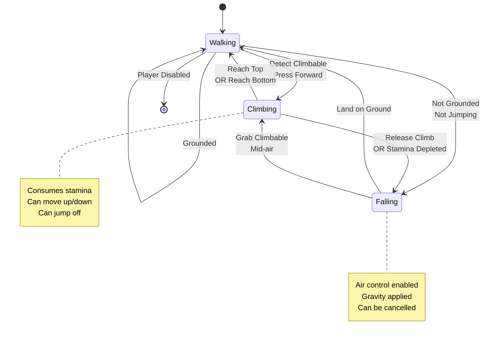

---

## Inventory System

### Inventory System Architecture

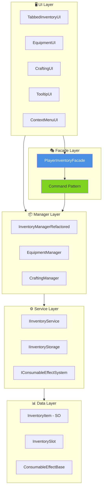

### Command Pattern Flow

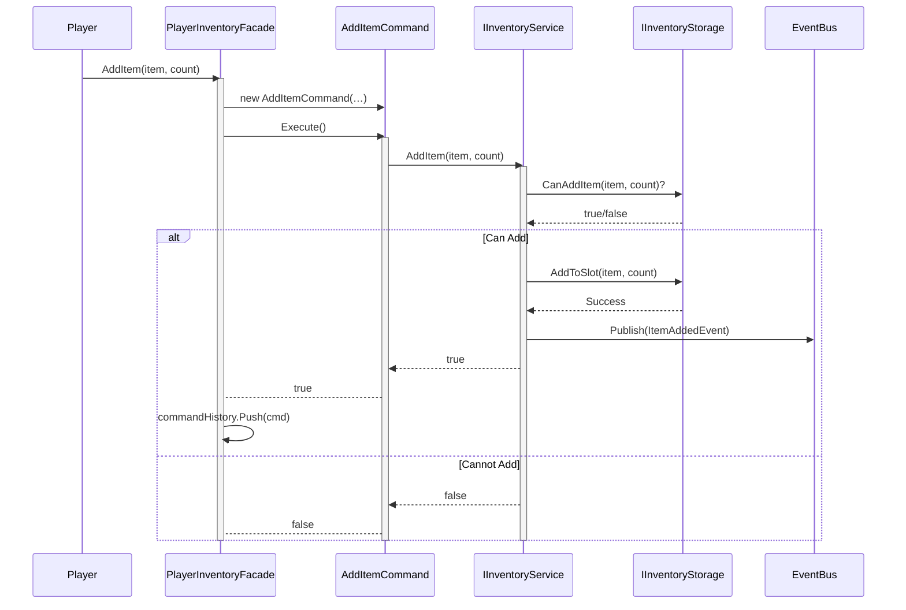

---

## Interaction System

### Interaction Detection Flow

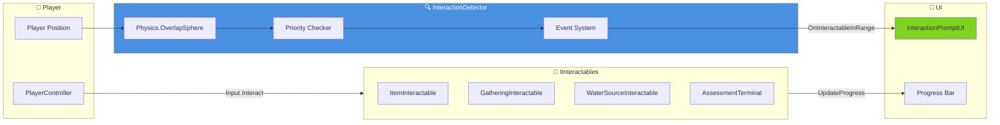

### Hold-to-Interact Template

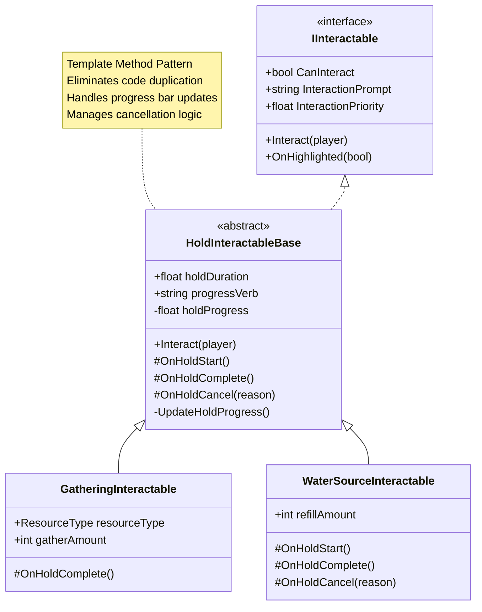

---

## Event Flow Diagrams

### Equipment Change Event Flow

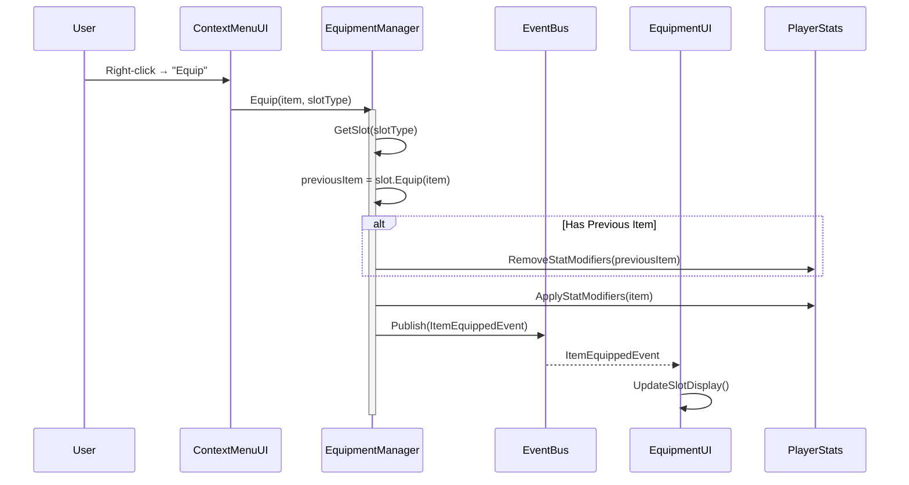

### Auto-Save Trigger Flow

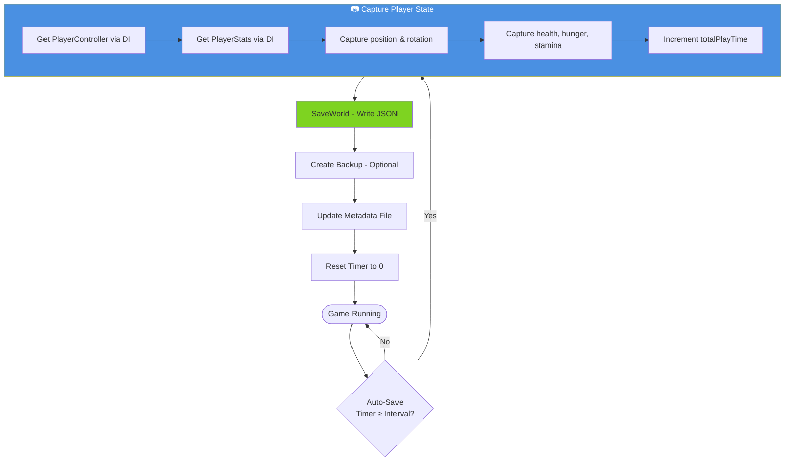

---

## Service Container Registry

### Dependency Injection Map

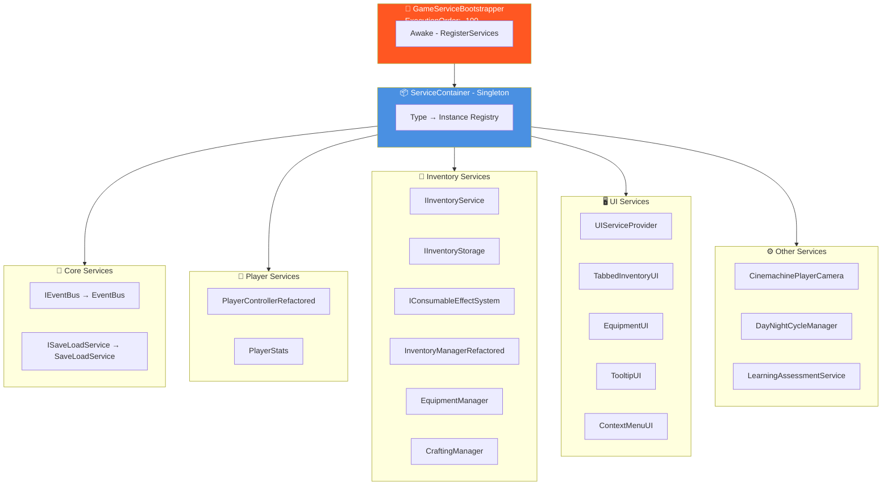

### Service Resolution Flow

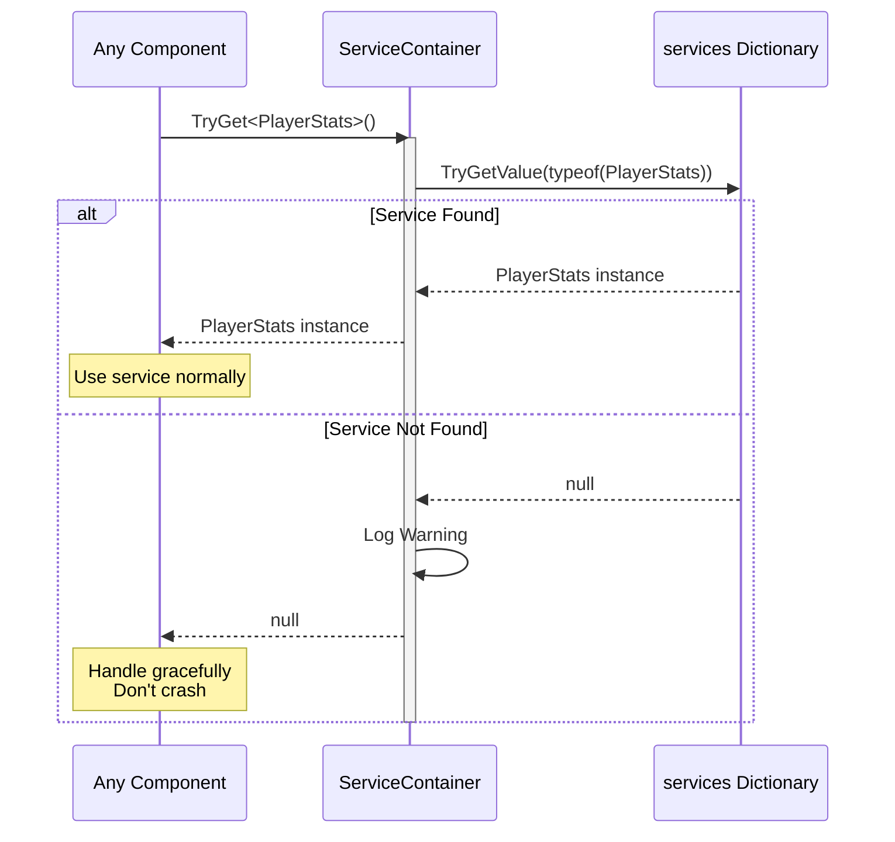

---

## Complete System Integration

### Game Initialization Sequence

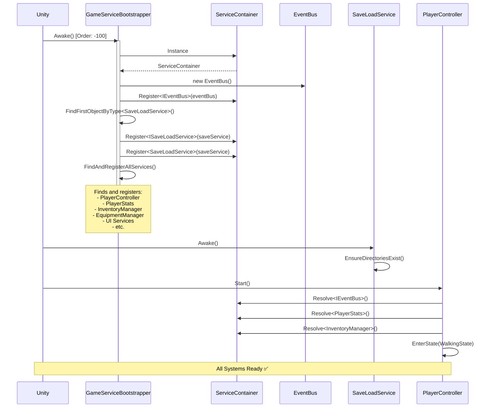

### Gameplay Loop with Auto-Save

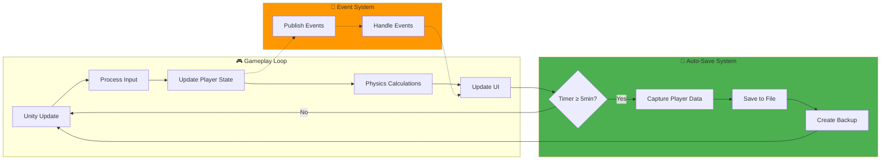

---

## Summary

This document provides visual representations of:
- ✅ System layer architecture
- ✅ Save/Load system flow and decision logic
- ✅ Player state machine and services
- ✅ Inventory command pattern
- ✅ Interaction detection and template method pattern
- ✅ Event-driven communication
- ✅ Service container dependency injection
- ✅ Complete game initialization sequence

**All diagrams use Mermaid syntax** and can be rendered in:
- GitHub
- GitLab
- VS Code (with Mermaid extension)
- Most modern markdown viewers

---

**Last Updated:** February 16, 2026
