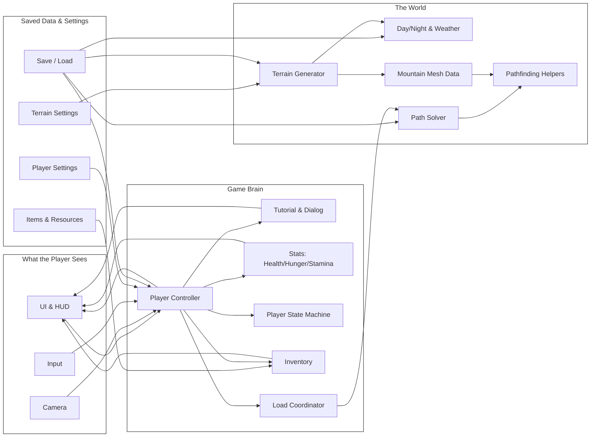
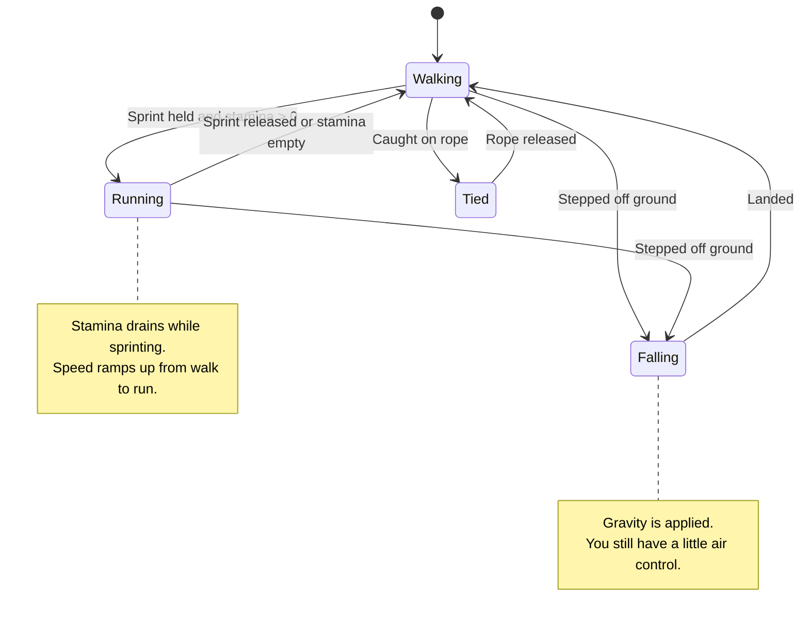

# Codebase Mermaid Diagrams - This is so PEAK

**Last Updated:** April 26, 2026
**Purpose:** Visual overviews of how the game is built, written for both new contributors and developers.

---

## How to read this document

Each section below has a **diagram** and a short **paragraph** explaining what the diagram is showing, in everyday language. You don't need to know Unity or C# to follow the first two sections — just think of each box as "a piece of the game" and each arrow as "this piece talks to that piece." The third section is denser and aimed at programmers.

---

## 1. Core System Interaction — How the Big Pieces Talk to Each Other

This diagram is a **bird's-eye view of the game**. The game is split into four areas: what the player sees on screen (the UI, camera, and input), the "brain" that runs the game (the player controller, stats, inventory, and story bits like dialogs and tutorials), the saved information (player settings, items, save files), and the world itself (terrain, weather, and pathfinding for finding routes up the mountain). Arrows mean "this piece uses or sends information to that piece." The takeaway: almost everything flows through the **Player Controller** — it's the central hub that ties input, stats, inventory, and the world together.

```mermaid
graph LR
    subgraph PlayerSide[What the Player Sees]
        UI[UI & HUD]
        Camera[Camera]
        Input[Input]
    end

    subgraph CoreGameLogic[Game Brain]
        Story[Tutorial & Dialog]
        PlayerController[Player Controller]
        StatSystem[Stats: Health/Hunger/Stamina]
        StateMachine[Player State Machine]
        Inventory[Inventory]
        PathRequest[Load Coordinator]
    end

    subgraph DataConfig[Saved Data & Settings]
        PlayerConfig[Player Settings]
        ItemResource[Items & Resources]
        TerrainSettings[Terrain Settings]
        SaveLoad[Save / Load]
    end

    subgraph WorldSystems[The World]
        Environment[Day/Night & Weather]
        TerrainGen[Terrain Generator]
        Heightmap[Mountain Mesh Data]
        Solver[Path Solver]
        PathHelpers[Pathfinding Helpers]
    end

    UI --> PlayerController
    Camera --> PlayerController
    Input --> PlayerController

    PlayerConfig --> PlayerController
    ItemResource --> Inventory
    TerrainSettings --> TerrainGen

    SaveLoad --> PlayerController
    SaveLoad --> Environment
    SaveLoad --> TerrainGen
    SaveLoad --> Solver

    PlayerController --> UI
    PlayerController --> StatSystem
    PlayerController --> Story
    PlayerController --> PathRequest
    PlayerController --> StateMachine
    PlayerController --> Inventory

    StatSystem --> UI
    Story --> UI
    Inventory --> UI

    PathRequest --> Solver
    Solver --> PathHelpers

    TerrainGen --> Heightmap
    TerrainGen --> Environment
    Heightmap --> PathHelpers

    style PlayerSide fill:#ffffff,stroke:#222,stroke-width:1px
    style CoreGameLogic fill:#ffffff,stroke:#222,stroke-width:1px
    style DataConfig fill:#ffffff,stroke:#222,stroke-width:1px
    style WorldSystems fill:#ffffff,stroke:#222,stroke-width:1px
```

**Quick glossary:**
- *Player Controller* — the main script that decides what the player is doing each frame.
- *State Machine* — a system that keeps the player in exactly one "mode" at a time (see Diagram 2).
- *Path Solver* — the code that figures out a route across the mountain when something needs to walk to a target.
- *Pathfinding Helpers* — supporting pieces (mesh data, cost calculation, debug visualizer) used by the path solver.

---

## 2. Player State Machine — What "Mode" the Player Is In

At any moment, the player character is in **one of four modes**: walking, running, falling, or tied (caught on a rope). This diagram shows what causes the player to switch between modes. For example, holding the sprint button while you have stamina turns walking into running; stepping off a ledge turns walking into falling; landing on the ground returns you to walking. The arrows are labeled with the *trigger* that causes the change. Two older modes — climbing and mantling — were removed from the game and aren't shown here.

```mermaid
stateDiagram-v2
    [*] --> Walking

    Walking --> Running: Sprint held and stamina > 0
    Walking --> Falling: Stepped off ground
    Walking --> Tied: Caught on rope

    Running --> Walking: Sprint released or stamina empty
    Running --> Falling: Stepped off ground

    Falling --> Walking: Landed

    Tied --> Walking: Rope released

    note right of Running
        Stamina drains while sprinting.
        Speed ramps up from walk to run.
    end note

    note right of Falling
        Gravity is applied.
        You still have a little air control.
    end note
```

**Quick glossary:**
- *State* — a "mode" the player can be in. Only one is active at a time.
- *Transition* — the arrow between states; the label says what causes it.

---

## 3. Overall Class Diagram — A Map for Developers

This last diagram is **for programmers**. It lists the major C# classes and how they're connected — which class owns which, which class implements which interface, and which class talks to which. If you're not a developer, you can skip the diagram and just read the buckets below: it's intentionally dense because it's used as a code-navigation reference.

The classes group into four buckets:
1. **Scene setup** — `GameplaySceneInitializer` boots the gameplay scene and restores world state from a save file.
2. **The player** — `PlayerControllerRefactored` (input + state), `PlayerModelRefactored` (the physical character), `PlayerStats` (health/hunger/stamina).
3. **Inventory & crafting** — `PlayerInventoryFacade` is the simple front door; behind it `InventoryManagerRefactored`, `EquipmentManager`, and `CraftingManager` do the actual work, all hidden behind the `IInventoryService` interface.
4. **World & support services** — saving (`SaveLoadService` + its data classes), interactables (`InteractionDetector` + `IInteractable` + `HoldInteractableBase`), the day/night cycle, dialog, tutorials, sound, and the UI service that owns the inventory/equipment/crafting screens.

```mermaid
classDiagram
    class GameplaySceneInitializer {
        +Start()
        +RestoreWorldState()
    }

    class PlayerControllerRefactored {
        +TransitionTo(IPlayerState)
        +HandleInput()
        +FixedUpdate()
    }

    class PlayerModelRefactored {
        +Transform transform
        +CharacterController characterController
        +PlayerConfig config
    }

    class PlayerStats {
        +float Health
        +float Hunger
        +float Stamina
        +SetRunning(bool)
        +SetWalking(bool)
    }

    class SaveLoadService {
        +WorldSaveData CurrentWorldSave
        +CreateNewWorld(name, seed, level)
        +LoadWorld(worldGuid)
        +SaveWorld(saveData)
        +PerformAutoSave()
    }

    class WorldSaveData {
        +string worldName
        +string worldGuid
        +SeedData seedData
        +PlayerSaveData playerData
        +WorldStateSaveData worldState
    }

    class PlayerSaveData {
        +float[] position
        +float[] rotation
        +float health
        +float hunger
        +float stamina
        +List~InventoryItemSaveData~ inventoryItems
    }

    class WorldStateSaveData {
        +float currentTimeOfDay
        +int dayNumber
        +string currentWeather
        +int level
    }

    class SeedData {
        +string seed1
        +string seed2
        +string seed3
        +string FullSeed
    }

    class InventoryManagerRefactored {
        +InitializeServices()
        +AddItem(item, qty)
        +RemoveItem(item, qty)
    }

    class EquipmentManager {
        +Equip(item, slotType)
        +Unequip(slotType)
    }

    class CraftingManager {
        +CanCraft(recipe)
        +Craft(recipe)
    }

    class PlayerInventoryFacade {
        +PickupItem(item, qty)
        +DropItem(item, qty)
        +UseItem(item)
        +CraftItem(recipe)
    }

    class IInventoryService {
        <<interface>>
        +AddItem(item, qty)
        +RemoveItem(item, qty)
        +HasItem(item, qty)
    }

    class InteractionDetector {
        +FindNearestInteractable()
        +TryInteract()
    }

    class IInteractable {
        <<interface>>
        +bool CanInteract
        +string InteractionPrompt
        +Interact(player)
    }

    class HoldInteractableBase {
        <<abstract>>
        +Interact(player)
        #OnHoldStart(player)
        #OnHoldComplete(player)
        #OnHoldCancel(player, reason)
    }

    class DayNightCycleManager {
        +float timeOfDay
        +AdvanceTime()
    }

    class CollectableManager {
        +Unlock(id)
        +IsUnlocked(id)
    }

    class DialogManager {
        +StartDialog(dialogData)
        +StopDialog()
    }

    class TutorialManager {
        +StartTutorial(id)
        +CompleteStep(step)
    }

    class SoundService {
        +PlaySound(id)
        +PlayMusic(id)
        +StopSound(id)
    }

    class UIServiceProvider {
        +EnsureInitialized()
        +ShowPanel(id)
        +HidePanel(id)
    }

    class TabbedInventoryUI {
        +Refresh()
    }

    class EquipmentUI {
        +UpdateSlotDisplay(slotType)
    }

    class CraftingUI {
        +RefreshRecipes()
    }

    GameplaySceneInitializer --> SaveLoadService
    GameplaySceneInitializer --> PlayerControllerRefactored
    GameplaySceneInitializer --> DayNightCycleManager
    GameplaySceneInitializer --> DialogManager

    PlayerControllerRefactored --> PlayerModelRefactored
    PlayerControllerRefactored --> PlayerStats
    PlayerControllerRefactored --> PlayerInventoryFacade
    PlayerControllerRefactored --> InteractionDetector
    PlayerControllerRefactored --> SoundService

    SaveLoadService --> WorldSaveData
    WorldSaveData --> PlayerSaveData
    WorldSaveData --> WorldStateSaveData
    WorldSaveData --> SeedData

    PlayerInventoryFacade --> IInventoryService
    InventoryManagerRefactored ..|> IInventoryService
    InventoryManagerRefactored --> EquipmentManager
    InventoryManagerRefactored --> CraftingManager

    InteractionDetector --> IInteractable
    HoldInteractableBase ..|> IInteractable

    CollectableManager --> TutorialManager

    UIServiceProvider --> TabbedInventoryUI
    UIServiceProvider --> EquipmentUI
    UIServiceProvider --> CraftingUI

    PlayerStats --> UIServiceProvider
    InventoryManagerRefactored --> UIServiceProvider
    EquipmentManager --> UIServiceProvider
    CraftingManager --> UIServiceProvider
```

---

## How to use these diagrams

- **New to the project?** Read the paragraph above each diagram. That's enough to get a mental picture of how the game fits together.
- **Working on a specific system?** Find that system's box in Diagram 1 — the arrows tell you what it depends on and what depends on it. Then jump to the per-system `*_OVERVIEW.md` file under `Assets/Game/Script/` for details.
- **Tracing code?** Use Diagram 3 plus the knowledge graph (`/graph-read <ClassName>`) to navigate without opening files.

These diagrams skip the **Event Bus** and **Service Container** on purpose — those are wiring layers that connect almost everything to everything, so showing them would just clutter the picture. They're documented in `CODEBASE_ARCHITECTURE_OVERVIEW.md`.
